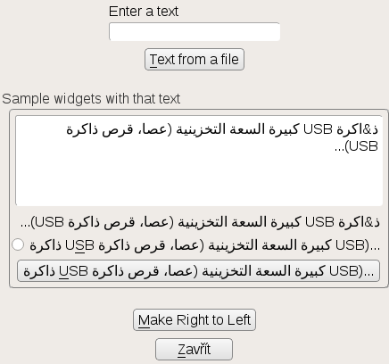
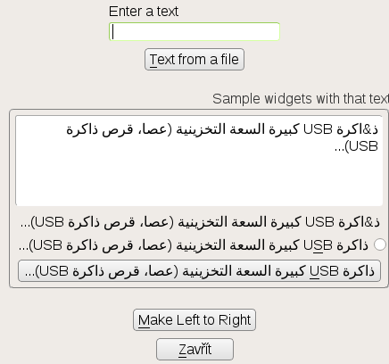
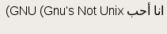
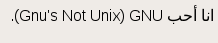
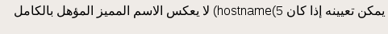
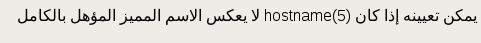

# Testing bidirectional text

## [bsc#989383](https://bugzilla.suse.com/show_bug.cgi?id=989383)

Test [bsc#989383](https://bugzilla.suse.com/show_bug.cgi?id=989383), where
parentheses are broken in a LTR layout but correct in a RTL layout.

Run this (never mind that the browser or the terminal may render the argument
incorrectly already):

    ./yast-test.rb "ذ&اكرة USB كبيرة السعة التخزينية (عصا، قرص ذاكرة USB)..."

Here the global context is left to right. Even if you cannot read Arabic, you
can observe that some of the widgets have both parentheses facing the same
way, which is wrong:

When we set the context to right-to-left, the labels are rendered correctly:

## [bsc#953334](https://bugzilla.suse.com/show_bug.cgi?id=953334)

This is a case of an English word with a parenthesised English gloss in an
Arabic text. Let's say "I love GNU (GNU's not Unix)":

    ./yast-label.rb "انا أحب GNU (Gnu's Not Unix)."

It helps to add an invisible right-to-left-mark (U+200F)
between the GNU and the opening parenthesis:

    ./yast-label.rb $'انا أحب GNU \u200F(Gnu\'s Not Unix).'

## [bsc#989391](https://bugzilla.suse.com/show_bug.cgi?id=989391)

"... may be set if hostname(5) does not reflect the FQDN ..."

    ./yast-label.rb $'يمكن تعيينه إذا كان hostname(5) لا يعكس الاسم المميز المؤهل بالكامل'

Fixed by adding a Left-to-right mark, U+200E, after the (5):

    ./yast-label.rb $'يمكن تعيينه إذا كان hostname(5)\u200e لا يعكس الاسم المميز المؤهل بالكامل'

For the "ldap://" issue, the fix is trickier: surrounding
the parens with LRMs *and* separating them from "URI" with a RLM.
(BTW the original string already contained a RLM before "ldap".)

msgid "URIs (ldap://) of LDAP servers (comma separated)"

Buggy:
msgstr "عناوين URI (‏ldap://) لخوادم LDAP (مفصولة باستخدام الفاصلة)"

Fixed:
msgstr "عناوين URI ‏‎(ldap://)‎ لخوادم LDAP (مفصولة باستخدام الفاصلة)"

